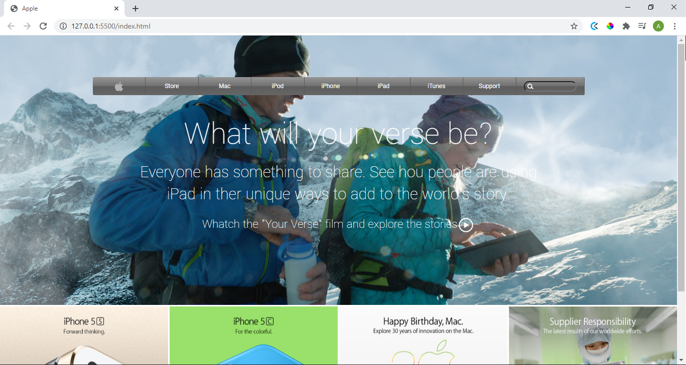

# Apple Page Clone

> An Apple page clone project

Additional description about the project and its features.

## Built With

- CSS & HTML.
- Flexbox and background gradients.
- Vs Code
- Git
- Github
- Linters

## Live Demo

[Live Demo Link](https://alejandrono4.github.io/Apple_page_clone/)

## Getting Started

This project was created with the propouse to learn background images and gradients. 

To get a local copy up and running follow these simple example steps.

### Prerequisites
Computer running Windows, Mac or Ubuntu.
Web browser: Chrome, Edge, Opera or Firefox. 

### Install
Clone the Git repository to your computer.

### Usage
Run the index.html file.

## Authors

👤 **Author1**

- GitHub: [@AlejandroNo4](https://github.com/AlejandroNo4)
- Twitter: [@Alejand80002666](https://twitter.com/Alejand80002666)
- LinkedIn: [Alejandro Contreras Rodriguez](https://www.linkedin.com/in/alejandro-contreras-rodriguez-b524821b5)

## Show your support

Give a ⭐️ if you like this project!

## Acknowledgments

- Old Apple page clone
## 🤝 Contributing

Contributions, issues, and feature requests are welcome!

Feel free to check the [issues page](https://github.com/AlejandroNo4/Apple_page_clone/issues).
